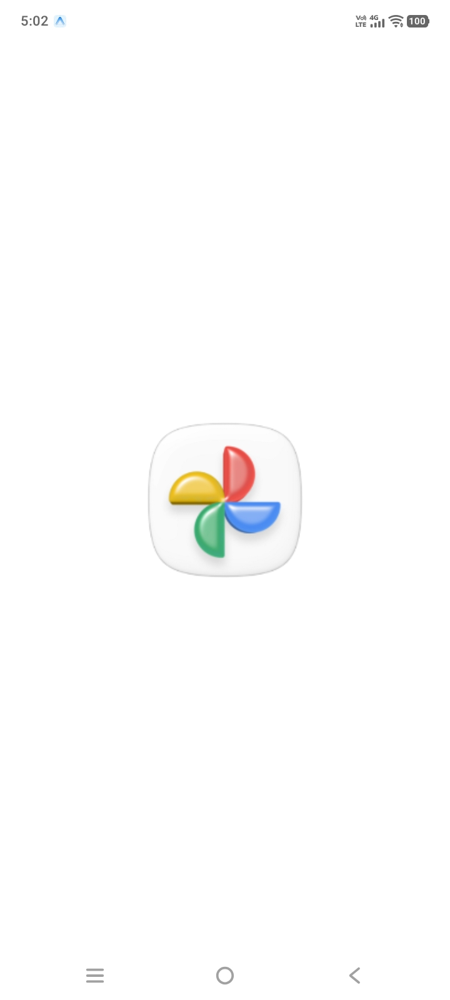
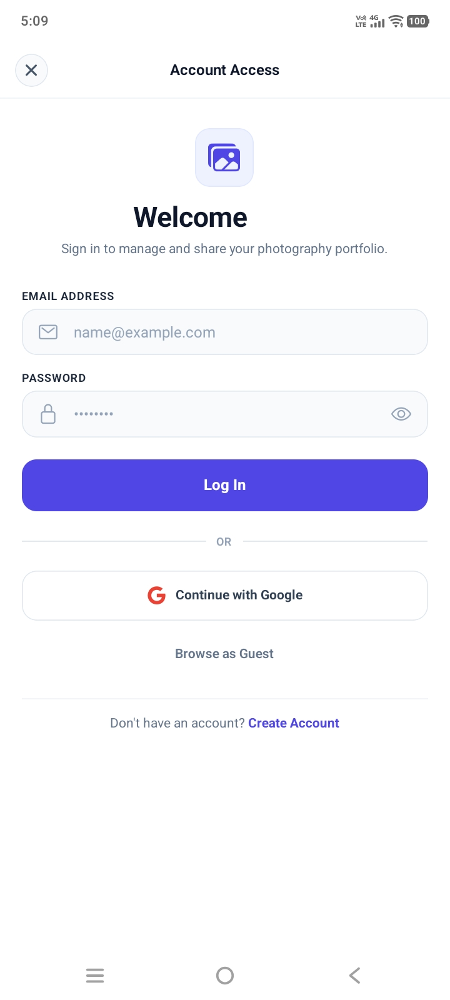
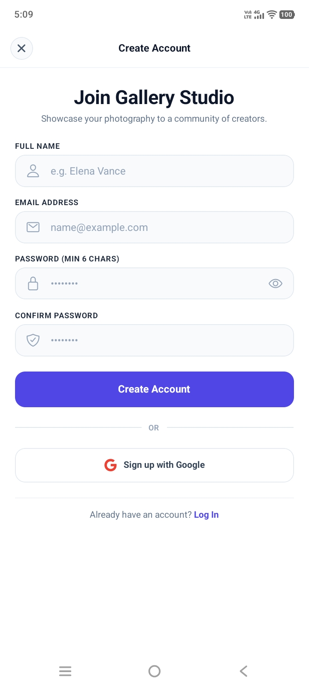
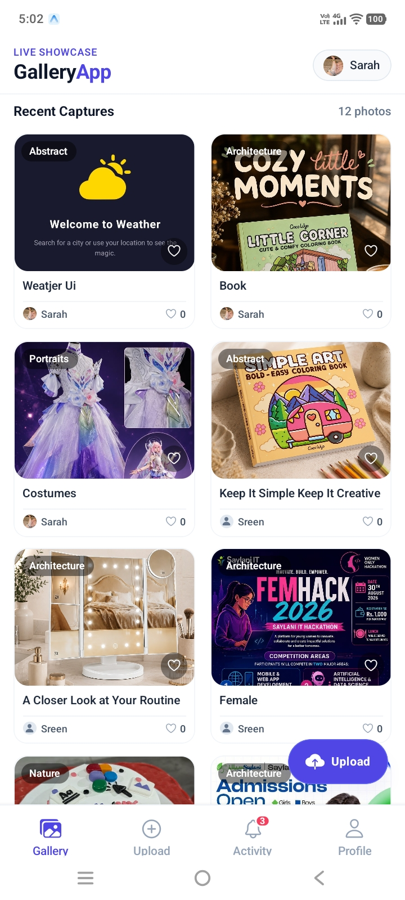
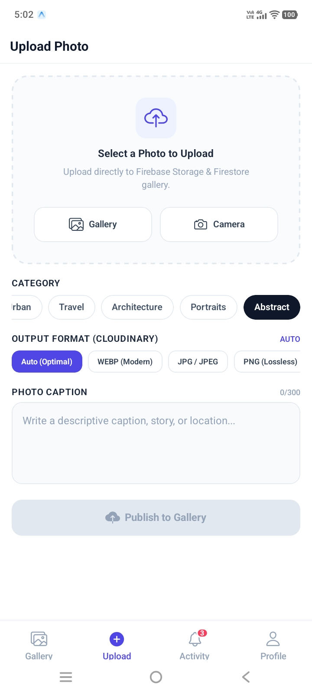
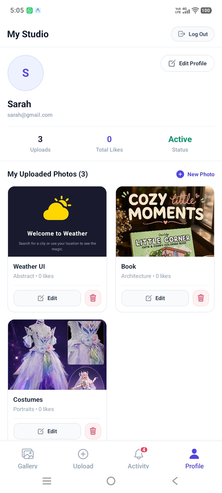
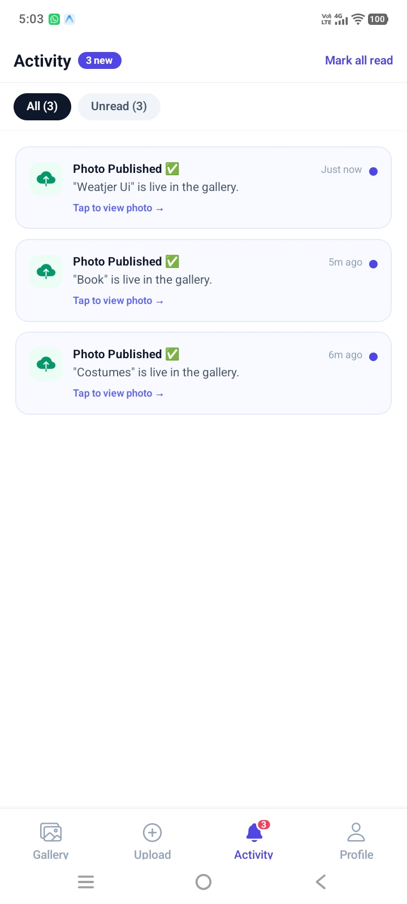
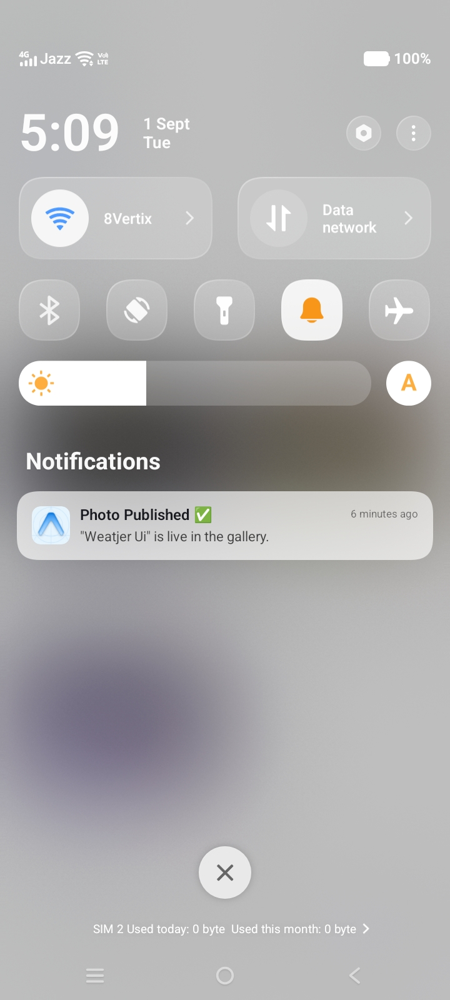

# 📸 Expo Gallery App

A modern mobile photography and gallery application built with **Expo (SDK 54)**, **React Native**, **Firebase**, and **Cloudinary**.

---

## 📱 App Screens

<table>
  <tr>
    <td align="center" width="50%" valign="top">
      <h3>1. 🚀 Splash / Loading Screen</h3>
      
        
      
<strong>Description:</strong> App start hone par yeh initial screen show hoti hai jahan app ke assets, fonts aur user authentication state load hoti hai.

    </td>
    <td align="center" width="50%" valign="top">
      <h3>2. 🔐 Login Screen</h3>
      
        
      
<strong>Description:</strong> Users apne Email & Password ya 1-Tap Google Sign-In se login kar sakte hain ya as a Guest explore kar sakte hain.

    </td>
  </tr>

  <tr>
    <td align="center" width="50%" valign="top">
      <h3>3. 📝 Sign Up Screen</h3>
      
        
      
<strong>Description:</strong> Naye users apna Full Name, Email aur Password darj kar ke naya account create kar sakte hain.

    </td>
    <td align="center" width="50%" valign="top">
      <h3>4. 🖼️ Gallery Feed (Home Screen)</h3>
      
        
      
<strong>Description:</strong> App ki main home feed jahan users ki upload ki gayi photos real-time 2-column grid mein show hoti hain jinhe browse, like aur view kiya ja sakta hai.

    </td>
  </tr>
  <tr>
    <td align="center" width="50%" valign="top">
      <h3>5. 📤 Upload Photo Screen</h3>
      
        
      
<strong>Description:</strong> Gallery ya Camera se photo choose karke category, Cloudinary format aur caption ke sath publish kiya jata hai.

    </td>
    <td align="center" width="50%" valign="top">
      <h3>6. 👤 User Profile (My Studio)</h3>
      
        
      
<strong>Description:</strong> User ka dashboard jahan upload stats, avatar aur apni photos show hoti hain jinhe edit ya delete kiya ja sakta hai.

    </td>
  </tr>

  <tr>
    <td align="center" width="50%" valign="top">
      <h3>7. 🔔 In-App Notifications</h3>
      
        
      
<strong>Description:</strong> App ke andar real-time notifications list hoti hain jo photo publish aur account activity ka status show karti hain.

    </td>
    <td align="center" width="50%" valign="top">
      <h3>8. 📱 Push Notification (Background)</h3>
      
        
      
<strong>Description:</strong> Photo publish hone par device ke status bar / notification tray mein native background push notification milti hai.

    </td>
  </tr>
</table>
